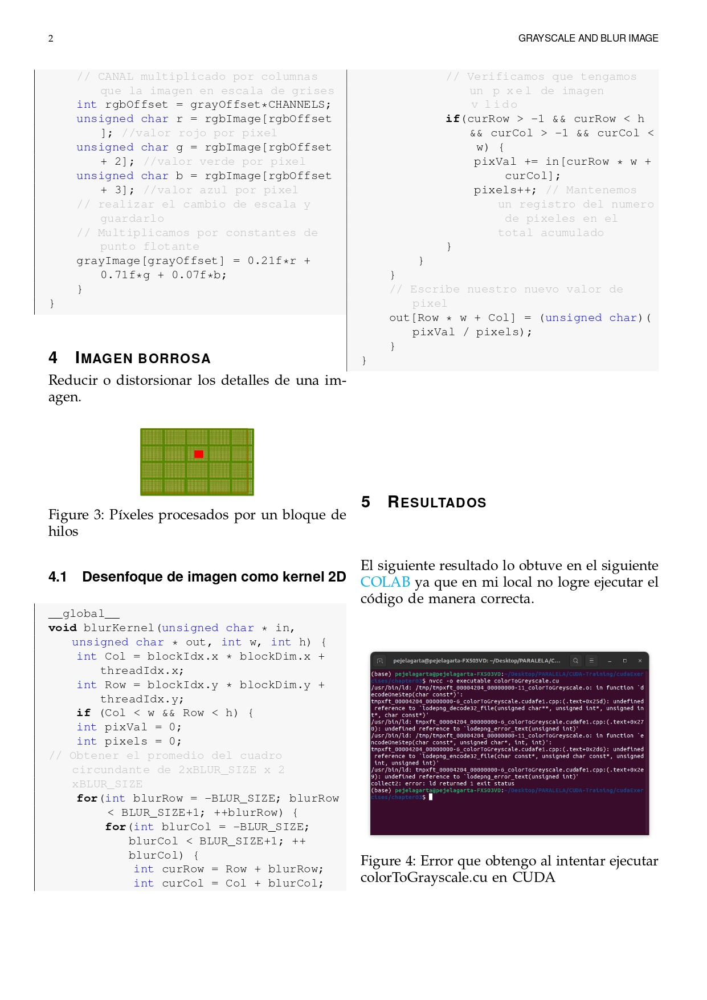
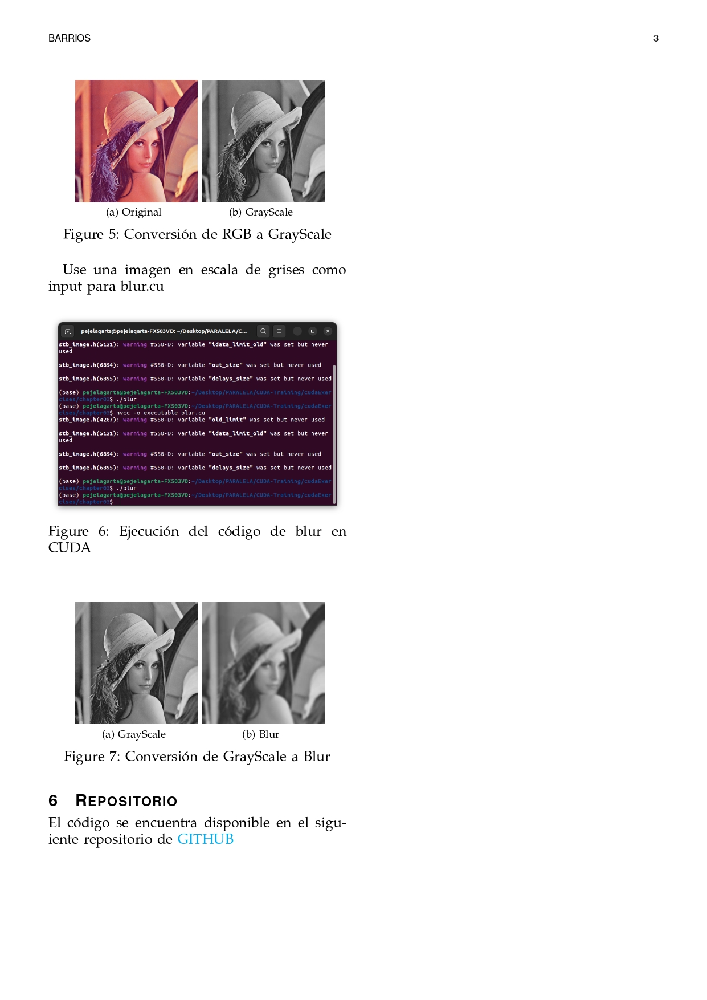

# INFORME

# REFERENCIAS

Kirk, D. B., & Wen-Mei, W. H. (2016). Programming massively parallel processors: a hands-on approach. Morgan kaufmann.

https://blog.jonaylor.xyz/how-to-manipulate-images-on-a-gpu
